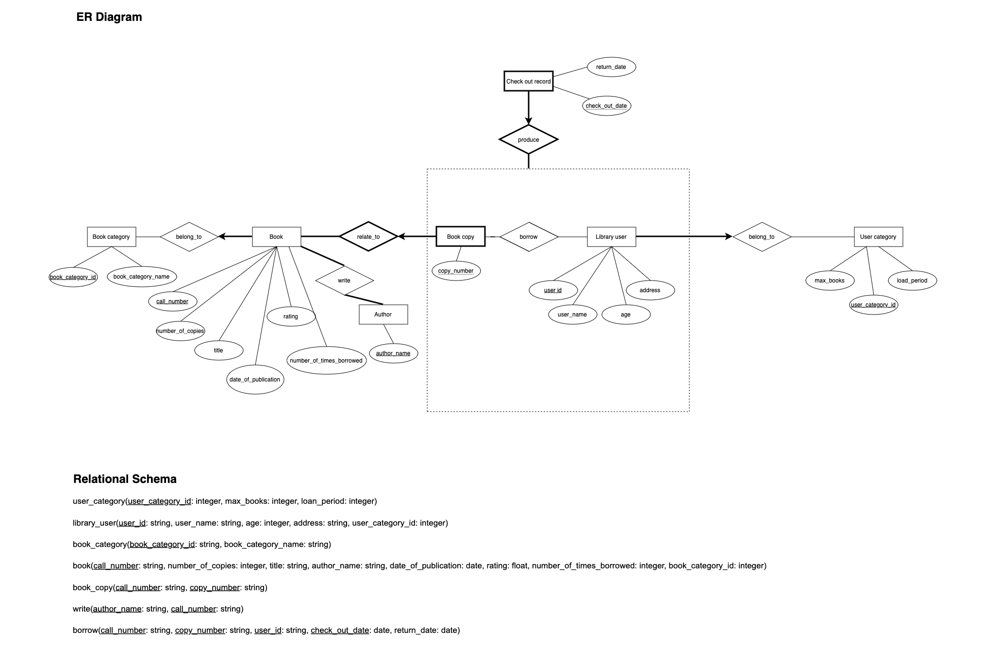

# CSCI 3170 Group Project: Library Inquiry System

## Description

A Library Inquiry System for a library so that all information about books in the library, library users, and loans are
stored. The system shall support interactive operations from operators. The system use Java JDBC API to access
the MySQL database. The project is implemented a Java command line application to realize all system functions stated 
in the specification.

The system needs CUHK CSE VPN for database connection.

## Run (run.sh)

```bash
javac LibraryInquirySystem.java
java -cp .:mysql-connector-java-5.1.47.jar LibraryInquirySystem
```
## ER Diagram


